# PowerBI Direct Connector Module

## Introductions

The **PowerBI Direct Connector Module** enables seamless integration between Odoo and PowerBI Desktop. With this module, users can directly fetch specific tables and fields from Odoo into PowerBI, The module supports both user-based access (with company restrictions) and full access using sudo mode.

## Features

 - **Direct Connector with PowerBI Desktop:** Establishes a direct connection between Odoo and PowerBI for efficient data retrieval.

 - **Fetch Particular Tables:** Allows users to select and fetch only the required tables, optimizing performance.

 - **Field Selection:** Users can specify the exact fields they need from each table.

 - **Dynamic Data Filtering with Odoo Domains:** Retrieve filtered table data using Odoo’s domain filtering mechanism for precise data extraction.

 - **Optimized Data Type Mapping:** Ensures accurate handling and conversion of Odoo data types for seamless PowerBI integration.

 - **Access Control:**

   - **User-Based Access:** Fetch data based on user permissions and company restrictions.

   - **Full Access (Sudo Mode):** Fetch all tables and fields without restriction.

 - **Real-Time Data Synchronization:** Refresh Data In PowerBI Desktop to fetch the latest data updates from Odoo.

## Configurations

### From Odoo

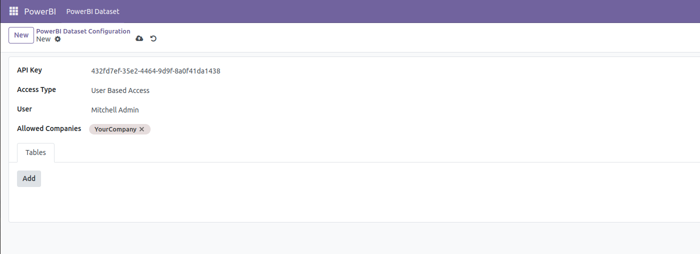

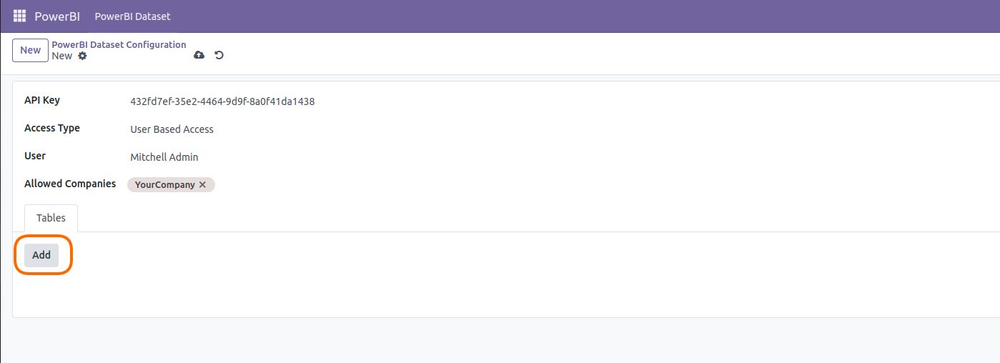

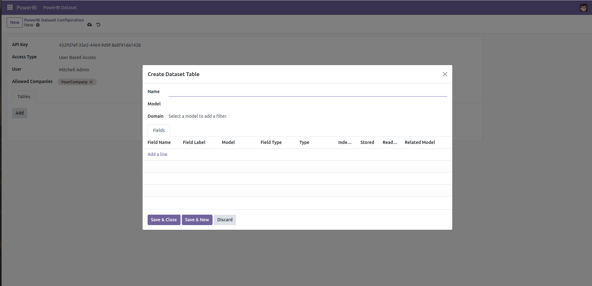

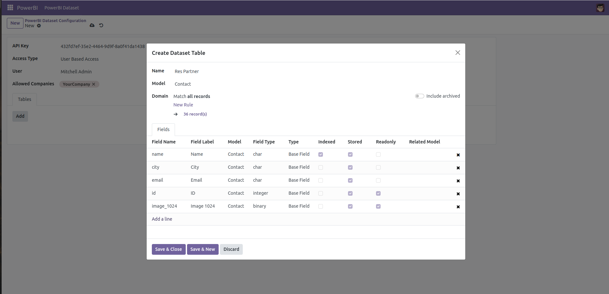

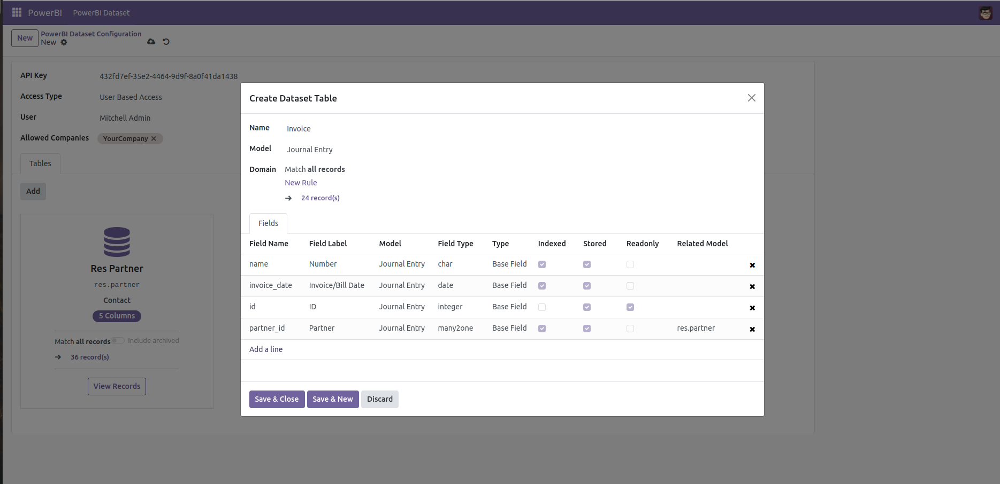

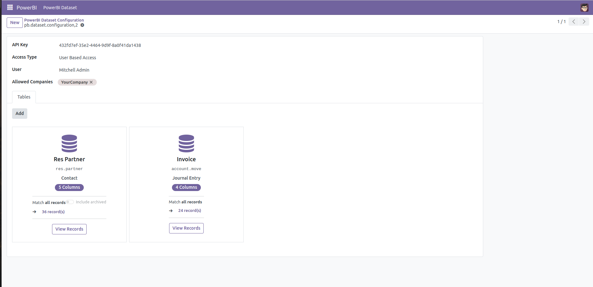

### From PowerBI Desktop

Open PowerBI -> File -> Options and settings -> Options -> Security -> Data Extensions
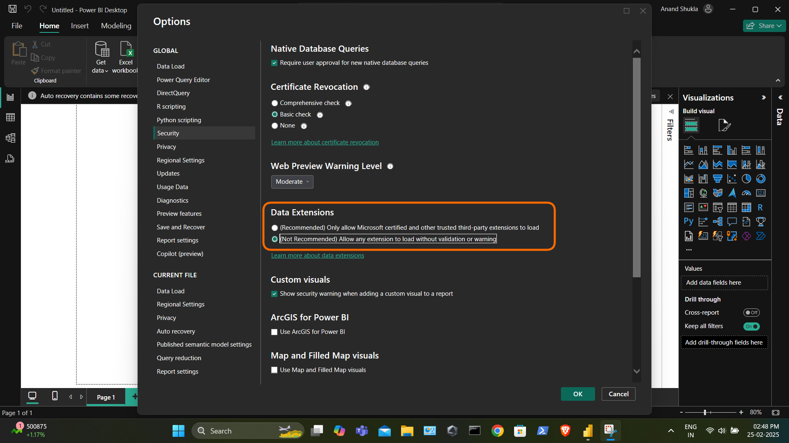

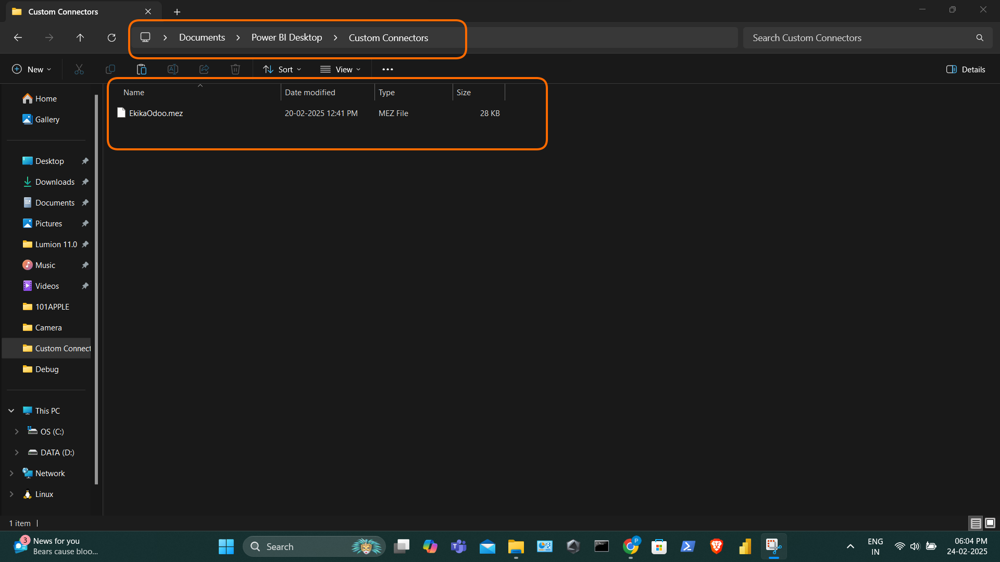

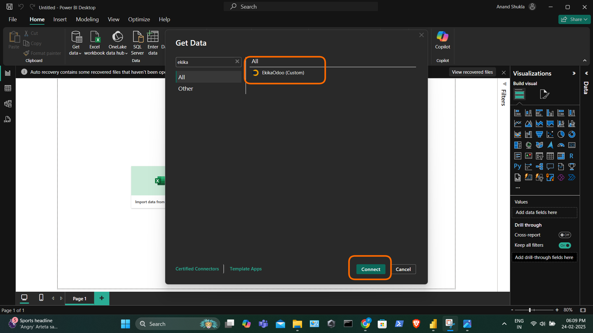

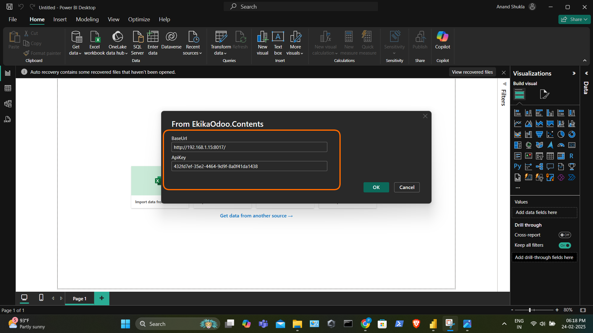

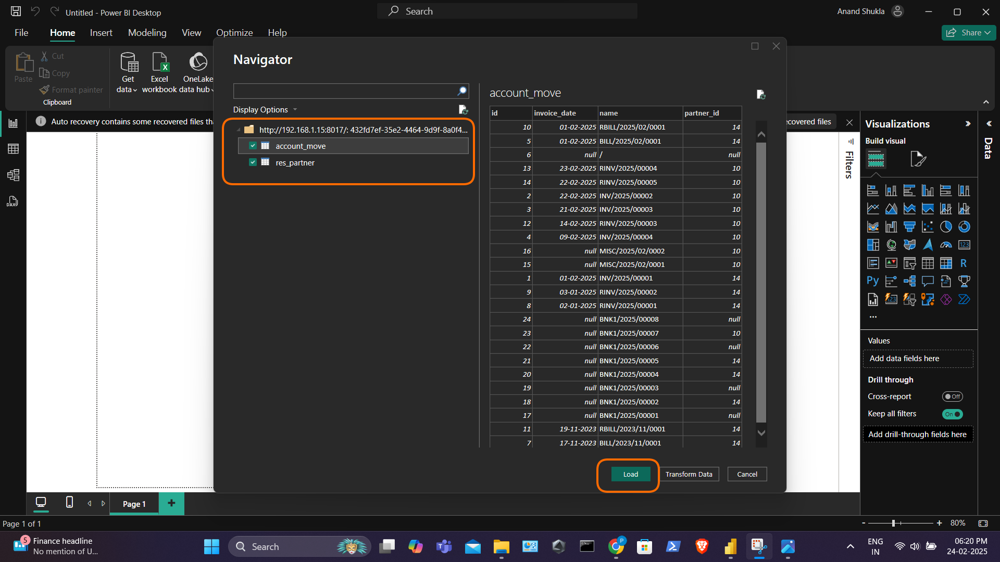

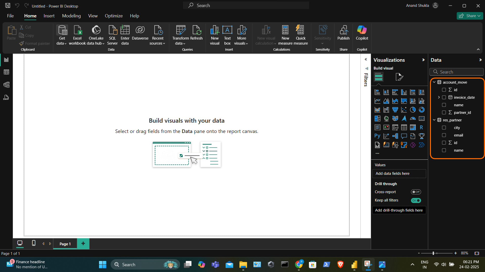

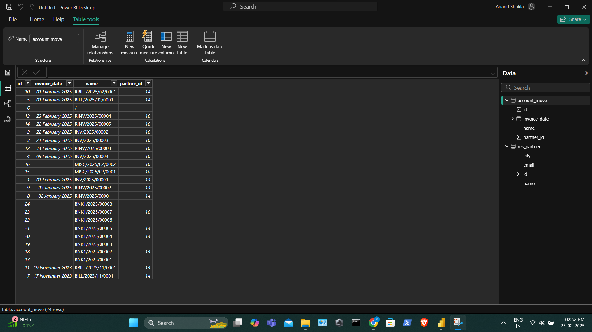

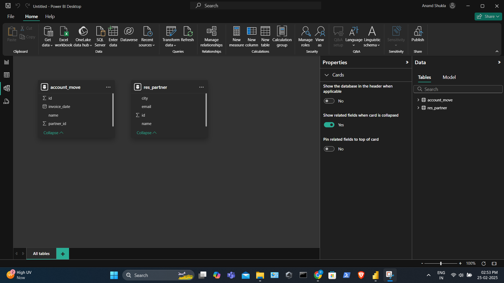

