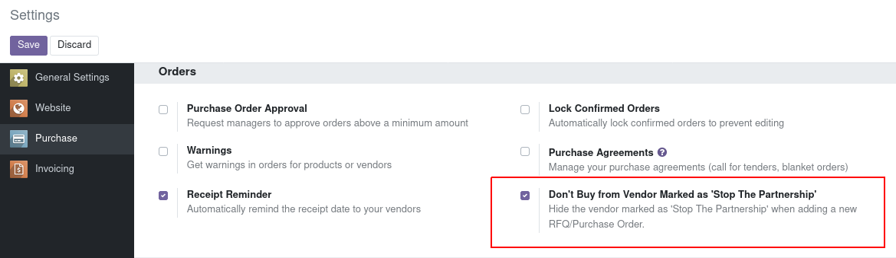

=========================================
Manage the assessment on Purchase order
=========================================

**Table of contents**

.. contents::
   :local:

Usage
=====

- New menus:
  *. Purchase | Assessment | Purchase
  *. Purchase | Assessment | Vendor
  *. Purchase | Configuration | Assessment | Template
  *. Purchase | Configuration | Assessment | Criteria
  *. Purchase | Configuration | Assessment | Purchase Result
  *. Purchase | Configuration | Assessment | Vendor Result

- New Configuration

Hide the vendor marked as 'Stop The Partnership' when adding a new RFQ/Purchase Order. 

Contributors
~~~~~~~~~~~~

* domiup <domiup.contact@gmail.com>
